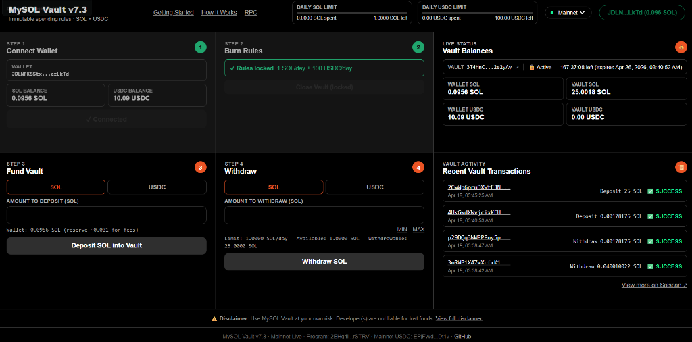

# MySOL Vault: Immutable Spending Rules

**MySOL Vault** is a non-custodial Solana protocol that allows users to lock **SOL** and **USDC** into a Program Derived Address (PDA) governed by immutable, on-chain spending limits.

* **Live dApp:** [Launch MySOL Vault (GitHub Pages)](https://dakman.github.io/mysol/mysol.html) 
    * *Default network is now **Mainnet**. Switch to **Devnet** in the UI for free testing.*
    * *The app uses an RPC endpoint for blockchain reads and transaction relay. Users can change the RPC from the UI if they want to use their own provider.*
* **On-Chain Program:** [View on Solscan (Mainnet)](https://solscan.io/account/2EHg4iqQxpi5ZuftbDrTw2XoKR5HM56AEbo8Am4rSTRV)
* **Smart Contract Logic:** The core enforcement rules are defined in [`lib.rs`](./mysol_program/programs/mysol_program/src/lib.rs).

---

## 🆕 Latest Features (v7.6)

*   **🖥️ Split Platform Instructions**: Clear, separate onboarding paths for Desktop (Extension) and Mobile (In-App Browser).
*   **📱 One-Click Mobile Onboarding**: Built-in **Copy URL** button to make it easy to paste the app into Phantom or Solflare.
*   **⏱️ Real-Time Reset Countdowns**: The dashboard displays a live countdown timer showing exactly when your daily spending limit will reset.
*   **🔌 Expanded Wallet Support**: Robust detection for **Solflare**, **Brave**, and in-app mobile browsers with intelligent connection labels.
*   **🔒 Permanent Immutability**: Program upgrade authority is permanently revoked (`Authority: none`).

---

## 🔎 How It Works

* 🔒 **Program Derived Vault (PDA)** — your vault address is derived on-chain from fixed seeds: `"vault"` + your wallet pubkey + `"v2"`. Same wallet, same vault for this program.
* 🧱 **No private key for vault** — a PDA is not a normal wallet. You cannot export/import it with a seed phrase. Funds move only through program instructions you sign from your own wallet.
* ⛔ **On-chain enforcement** — daily limits are checked inside the smart contract, so over-limit withdrawals fail at runtime even if someone uses a custom frontend.
* 💵 **Dual-asset controls** — SOL and USDC each have independent limit, spent-today counter, and last-withdraw timestamp. One asset hitting limit does not block the other.
* 🕒 **Rolling 24h behavior** — limits reset by elapsed time from last withdrawal, not midnight. After enforcement expires, withdrawals are unrestricted but funds remain in the vault until you move them.
* 🛡️ **Security model** — authority checks tie vault actions to your wallet. Attackers cannot bypass limits by changing UI code; transactions still must satisfy on-chain constraints.
* 🌐 **RPC endpoint** — the app needs an RPC gateway to read balances, fetch vault state, and send your signed transactions to Solana. The RPC can affect availability and read reliability, but it cannot sign for you or bypass on-chain rules.
* ⚙️ **Devnet-only testing tools** — reset/end-enforcement flows are intended for test usage on devnet only. Mainnet users should treat the live program as the real spend-control path.

---

## Motivations: Why Use a Spending Vault?

The core motivation is **self-sovereign discipline for high-risk behavior**. This project is aimed at degens and gamblers who want hard on-chain friction between a win and the impulse to blow it back.

* **Anti-Chasing Guardrail:** After a big win, funds in a normal wallet can be redeposited instantly. MySOL adds daily withdrawal constraints so you cannot immediately loop winnings back into higher-risk bets.
* **Willpower as a Service:** By moving spending limits to the blockchain, you outsource discipline to deterministic program rules instead of emotion in the moment.
* **Damage Limiter:** This is a harm-reduction tool. It will not stop losses completely, but it can limit how fast you can lose money in a single day.

---

## 🛠 Multi-Asset Support: SOL & USDC

MySOL Vault handles both native Solana and SPL Tokens (specifically USDC).

* **Native SOL:** Handled via direct lamport reassignment from the Vault PDA to the user.
* **USDC (SPL Token):** The vault creates an Associated Token Account (ATA) owned by the Vault PDA. Withdrawals are executed via `transfer_checked` CPI (Cross-Program Invocation).
* **Mainnet USDC Mint:** `EPjFWdd5AufqSSqeM2qN1xzybapC8G4wEGGkZwyTDt1v`
* **RPC:** The frontend uses an RPC endpoint to read chain data and broadcast signed transactions. Users can override the RPC from the app UI.

---

## 🎯 Use Cases

* **The Profit Protector:** Lock away daily trading profits in USDC so you don't trade them back into the market during a "tilt."
* **The Big-Win Lockbox:** After a large gambling/trading win, move funds into the vault so you can't immediately redeposit and chase bigger wins or recover losses impulsively.
* **The Living Allowance:** Deposit your monthly budget in USDC and set a daily limit (e.g., $50/day) to ensure your rent money lasts.
* **The Damage-Control Layer:** Keep a larger stack in the vault and expose only daily-sized amounts to impulsive decisions. This is a behavioral guardrail, not a full wallet-security solution.

---

## ✅ Mainnet Status & Program Metadata

**As of April 19, 2026, MySOL Vault is live on Solana mainnet and permanently immutable.**

* **Mainnet Program ID:** [`2EHg4iqQxpi5ZuftbDrTw2XoKR5HM56AEbo8Am4rSTRV`](https://solscan.io/account/2EHg4iqQxpi5ZuftbDrTw2XoKR5HM56AEbo8Am4rSTRV) (Authority: none)
* **Framework:** Anchor 0.32.1
* **Account Seeds:** `[b"vault", user_pubkey, b"v2"]`
* **Vault Account Space:** 128 bytes
* **Devnet** is still available for testing and demo usage.

---

## ⚠️ Security Architecture & Disclaimer

* **Non-Custodial:** Funds are held by the program code on-chain, not by a third-party developer.
* **On-Chain Enforcement:** Limits are checked by program logic, not by UI state.
* **Wallet-Scoped Authority:** Vault actions require the original wallet authority checks.
* **Immutable:** The program's upgrade authority has been revoked (`Authority: none`). It cannot be modified by anyone.

> **Disclaimer:** Use MySOL Vault at your own risk. Developer(s) are not liable for lost funds. Vault withdrawals/deposits require valid on-chain instructions signed by the original vault owner wallet; this can be done via this app or other compatible Solana clients. One vault per wallet. This project is not financial advice.

---

## 📸 Live Dashboard
<p align="center">
  
</p>

---

## 🚀 Getting Started

### 🖥️ Desktop (Extension)
1. Install the **Phantom** or **Solflare** browser extension.
2. Open the [Live App](https://dakman.github.io/mysol/mysol.html) in your browser.
3. Click **Connect Wallet** and set your spending limits.

### 📱 Mobile (App)
1. Install **Phantom** or **Solflare** from the App Store / Play Store.
2. Copy this URL: `https://dakman.github.io/mysol/mysol.html`
3. Open your wallet app and tap the **dApp Browser** (usually a 🌐 Globe icon).
4. Paste the URL into the dApp browser and click **Connect Wallet**.

---

**Next Steps:** Once connected, click **Sign & Burn Rules** to lock your spending limits. You can then deposit SOL or USDC into your unique vault address.

> **Note:** Mainnet is live. Use **Devnet** only for testing. Devnet tokens can be requested at [faucet.solana.com](https://faucet.solana.com/).

**Security Note:** This program is immutable (`Authority: none`) and non-custodial. Funds move only via your wallet signature.

---

## 💻 Local Development

**To run locally:**
1.  Clone this repository.
2.  Open `mysol.html` in your browser or dApp browser.
3.  Set your wallet to **Devnet** for testing.

```bash
# No dependencies required to view the UI
open mysol.html
```
